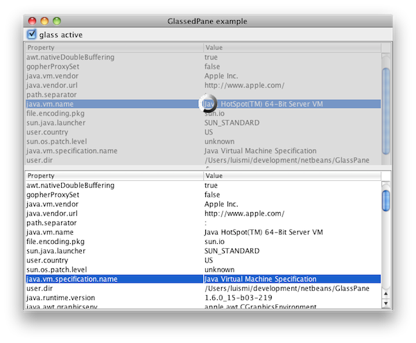
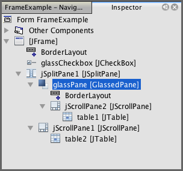

Glassed Pane
============

*   [Usage and javadoc](#usage)
*   [Default behaviour](#behaviour)
*   [Similar functionality](#similar)
*   [Download](#download)
*   [License](#license)

GlassedPane is a simple swing component that facilitates the usage of a glass pane, usually limited to the [JRootPane](http://java.sun.com/javase/6/docs/api/javax/swing/JRootPane.html), to any swing container.

This [example](example.jar) shows it in action, with a snapshot shown below:

In this snapshot, one component in the frame (a table plus its scroll pane), is blocked behind a grayed, semitransparent glass that shows an animated icon. Under Netbeans' Matisse, this component appears as:

There are two working components in action: the GlassPane, blocking the content, and the GlassedPane, a container for both the normal content and the glass itself. It must be noted that the GlassPane is any [JComponent](http://www.j2ee.me/javase/6/docs/api/javax/swing/JComponent.html). Although it is intended to be kind of a glass blocking the normal component, it could be any other component to replace the usual one. In this sense, GlassedPane is implementing a subset of the funcionality directly provided by the [JLayeredPane](http://java.sun.com/javase/6/docs/api/javax/swing/JLayeredPane.html): indeed, the behaviour provided by GlassedPane can be implemented directly using the standard JLayeredPane; its value is to simplify its usage for the specific glass scenario.

Usage and javadoc
-----------------

The javadoc information for the library is available [here](https://coderazzi.net/glassedpane/api/index.html)

The following code, extracted from the test included in the distribution, shows how the GlassedPane is implemented in the example above:

    //initialization, empty constructor
    net.coderazzi.glasspane.GlassedPane glassPane = new net.coderazzi.glasspane.GlassedPane();
    
    //set the layout. It is a normal container
    glassPane.getContentPane().setLayout(new java.awt.BorderLayout());
    
    //add the normal component
    glassPane.getContentPane().add(jScrollPane2, java.awt.BorderLayout.CENTER);
    
    //add the glasspane itself to a swing container
    jSplitPane1.setLeftComponent(glassPane);

Afterwards, the glass pane can be visualized / hidden using code such as:

    glassPane.getGlassPane().setVisible(booleanValue);

Default behaviour
-----------------

By default, the content pane is a [JPanel](http://java.sun.com/javase/6/docs/api/javax/swing/JPanel.html), although the user can setup any other swing container instead.

Also by default, the glass pane is a [GlassPane](https://coderazzi.net/glassedpane/api/net/coderazzi/glasspane/GlassPane.html). However, any other component can be instantiated by default, just by overriding the system property "net.coderazzi.glasspane.glassclass", defined as [GlassedPane.GLASS\_CLASS\_PROPERTY](https://coderazzi.net/glassedpane/api/net/coderazzi/glasspane/GlassedPane.html#GLASS_CLASS_PROPERTY). Obviously, it is also possible to use the normal API to set other component, using the method [GlassedPane.setGlassPane](https://coderazzi.net/glassedpane/api/net/coderazzi/glasspane/GlassedPane.html#setGlassPane(java.awt.Component))

The default glass pane merely blocks the user access to the content behind, and is displayed in a grayed semitransparent color. It is possible to define also the default color and degree of transparency, using system properties:

*   Change the default background, by defining the system property "net.coderazzi.glasspane.glasscolor", defined as [GlassPane.GLASS\_COLOR\_PROPERTY](https://coderazzi.net/glassedpane/api/net/coderazzi/glasspane/GlassPane.html#GLASS_COLOR_PROPERTY)
*   Change the transparency level, by defining the system property "net.coderazzi.glasspane.glasstransparency", defined as [GlassPane.GLASS\_TRANSPARENCY\_PROPERTY](https://coderazzi.net/glassedpane/api/net/coderazzi/glasspane/GlassPane.html#GLASS_TRANSPARENCY_PROPERTY)

Alternatively, it is possible to just invoke [GlassPane.setColor](https://coderazzi.net/glassedpane/api/net/coderazzi/glasspane/GlassPane.html#setColor(java.awt.Color)) on the GlassPane instance.

The library is provided with a second GlassPane, [LabelGlassPane](https://coderazzi.net/glassedpane/api/net/coderazzi/glasspane/LabelGlassPane.html), with adds a [JLabel](http://www.j2ee.me/javase/6/docs/api/javax/swing/JLabel.html), centered automatically in the GlassPane. It is possible to setup a message or an icon. By default, it will use the icon found on the system property "net.coderazzi.glasspane.labelicon", defined as [LabelGlassPane.GLASS\_MESSAGE\_ICON\_PROPERTY](https://coderazzi.net/glassedpane/api/net/coderazzi/glasspane/LabelGlassPane.html#GLASS_MESSAGE_ICON_PROPERTY).

Similar functionality
---------------------

Before writing this component, I checked for existing implementations. I liked specially this one in [The Rabbit Hole](http://rabbit-hole.blogspot.com/2006/04/decoratingoverpainting-swing.html). Although it is not really equivalent on functionality (does not block the user input), it has the advantage that there is no need to create a specific component in order to hide the content behind: it is painted directly over the component to hide. The code and the list of TODOs inside discouraged me, together with the notion to have to implement the paint method -not being able to just using a JLabel, with an icon / animated icon-.

Download
--------

This component is available with the MIT open source license (see below its text).

*   Version 1.0.0 (20th November 2009)
    *   [glasspane-1-0-0.zip](https://coderazzi.net/glassedpane/glasspane-1-0-0.zip)

License
-------

GlassPane is available under the MIT license.

Copyright (c) 2009 Luis M. Pena  - lu@coderazzi.net

Permission is hereby granted, free of charge, to any person obtaining a copy
of this software and associated documentation files (the "Software"), to deal
in the Software without restriction, including without limitation the rights
to use, copy, modify, merge, publish, distribute, sublicense, and/or sell
copies of the Software, and to permit persons to whom the Software is
furnished to do so, subject to the following conditions:

The above copyright notice and this permission notice shall be included in
all copies or substantial portions of the Software.

THE SOFTWARE IS PROVIDED "AS IS", WITHOUT WARRANTY OF ANY KIND, EXPRESS OR
IMPLIED, INCLUDING BUT NOT LIMITED TO THE WARRANTIES OF MERCHANTABILITY,
FITNESS FOR A PARTICULAR PURPOSE AND NONINFRINGEMENT. IN NO EVENT SHALL THE
AUTHORS OR COPYRIGHT HOLDERS BE LIABLE FOR ANY CLAIM, DAMAGES OR OTHER
LIABILITY, WHETHER IN AN ACTION OF CONTRACT, TORT OR OTHERWISE, ARISING FROM,
OUT OF OR IN CONNECTION WITH THE SOFTWARE OR THE USE OR OTHER DEALINGS IN
THE SOFTWARE.

The provided GlassedPane component's icon forms part of the WYSIWYG Sapphire set of free icons, available at [dryicons](http://dryicons.com/free-icons/icons-list/wysiwyg-sapphire/)

The included example contains an animated gif, generated with the nice [ajax loading gif generator](http://www.ajaxload.info/)